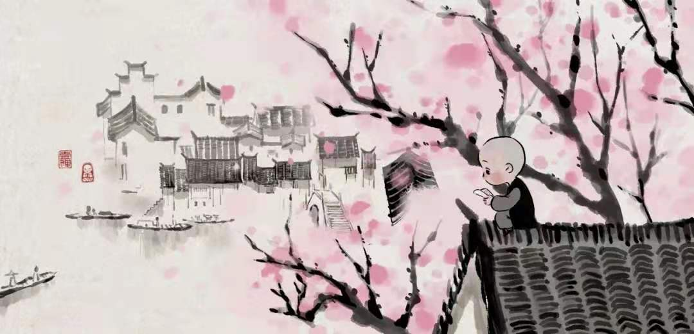

所读，所思，所感，所悟，  
所获，所弃，所悲，所乐，所行，所见……    
一草一木，一言一行，一怒一笑，皆化作笔墨，暂记于此，吧……

    

# 每一个不曾起舞的日子，都是对生命的辜负！  

- ### 每一个不曾起舞的日子，都是对生命的辜负！               ——尼采

- ### 路漫漫其修远兮，吾将上下而求索。                       ——屈原

- ### 要么庸俗，要么孤独。                                  ——叔本华
    
